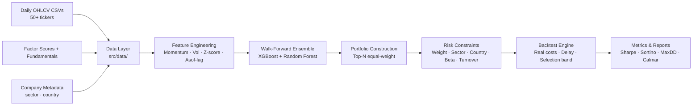

# Systematic Investment Pipeline

End-to-end systematic equity investment pipeline: cross-sectional return prediction with an XGBoost/Random Forest ensemble, risk-constrained portfolio construction, and walk-forward backtesting with realistic transaction cost modelling.


---

## Architecture Overview



---

## Tech Stack

| Layer | Technology |
|-------|-----------|
| Data loading | `pandas` (CSV ingestion with type coercion) |
| Feature engineering | Cross-sectional z-score, momentum, rolling volatility |
| Prediction models | `xgboost` · `sklearn.RandomForestRegressor` (ensemble) |
| Portfolio optimisation | Top-N selection + iterative projection for constraints |
| Backtesting | Custom monthly engine with transaction costs |
| Risk management | Beta overlay, sector/country caps, turnover limit |
| Configuration | `pyyaml` (prod / paper profiles) |
| Testing | `pytest` |
| Linting / typing | `ruff` · `mypy` |
| CI | GitHub Actions |

---

## Project Structure

```
systematic-investment/
├── pipeline.py               # Entrypoint: --config configs/config_prod.yaml
├── pyproject.toml
├── requirements.txt
├── configs/
│   ├── config_prod.yaml      # Production constraints (β_max=1.1, turnover=30%)
│   └── config_paper.yaml     # Paper trading (β_max=1.2, turnover=35%)
├── src/
│   ├── data/
│   │   └── loader.py         # DataLoader: prices, factors, fundamentals, metadata
│   ├── features/
│   │   └── engineering.py    # FeatureEngineer: monthly resampling, asof-lag, z-score
│   ├── models/
│   │   ├── estimators.py     # XGBoost / Random Forest factory
│   │   └── walk_forward.py   # Expanding-window WalkForward loop
│   ├── portfolio/
│   │   └── construction.py   # Top-N selection + equal-weight benchmark
│   ├── backtesting/
│   │   └── engine.py         # backtest_with_real_costs (costs, delay, band)
│   ├── risk/
│   │   ├── limits.py         # Weight caps, sector/country caps, turnover cap
│   │   └── beta.py           # Beta computation + hedge ratio
│   └── utils/
│       ├── metrics.py        # Canonical portfolio_kpis (CAGR, Sharpe, Sortino, MaxDD)
│       ├── monitor.py        # Rolling metrics + breach alerts + text reports
│       ├── artifacts.py      # Artifact persistence, run manifest
│       ├── config.py         # YAML loading + Paths/Config builders
│       └── types.py          # Paths, Config dataclasses
├── tests/                    # 27 tests across all modules
├── docs/
│   ├── strategy.md           # Signal logic, portfolio construction, risk framework
│   └── architecture.md       # Module map, data flow, config system
└── .github/workflows/ci.yml
```

---

## Pipeline Description

### 1. Data Ingestion (`src/data/`)

Loads three data sources and merges them into a single monthly panel:

- **Daily OHLCV**: per-ticker CSV files with numeric type coercion (handles `%`, comma-decimal, thousands separators).
- **Factor scores + fundamentals**: merged on `(Date, ticker)` to create a static factor panel.
- **Company metadata**: sector and country tags for concentration-constraint enforcement.

### 2. Feature Engineering (`src/features/`)

Monthly resampling from daily prices, then three-stage cross-sectional processing:

| Step | Description |
|------|-------------|
| Asof-lag (shift=1) | Forward-fill gaps within each ticker, then shift by 1 period — strictly no look-ahead |
| Winsorise | Clip at 1st/99th percentile cross-sectionally — removes universe outliers |
| Z-score | Centre and scale each feature cross-sectionally per month |

Features with >20% missing values after transformation are dropped from that fold.

### 3. Walk-Forward Prediction (`src/models/`)

Expanding training window: the model trains on `[t - lookback, t)` and predicts month `t+1`. An ensemble averages XGBoost and Random Forest predictions:

- **XGBoost**: regularised (α=1, λ=2), depth-limited (4), histogram splits — robust on tabular factor data.
- **Random Forest**: 500 trees with `min_samples_leaf=5` — low-variance counterpart.
- **Ensemble**: equal-weight average reduces idiosyncratic overfitting.

### 4. Portfolio Construction (`src/portfolio/`)

Top-N stocks by ensemble score, equal-weighted (1/N). The selection band widens the candidate pool to 1.5× top_n to enable continuity-first holding — stocks already in the portfolio that remain in the extended pool are retained, reducing unnecessary rebalancing.

### 5. Risk Constraints (`src/risk/`)

Applied in sequence at each rebalance:

1. **Individual weight cap** (7%): prevents single-stock concentration.
2. **Sector cap** (25%): iterative proportional scaling across up to 10 passes.
3. **Country cap** (40%): same iterative approach.
4. **Beta hedge overlay**: if portfolio β > β_max, short market exposure is applied proportionally.
5. **Turnover cap** (30%/month): greedy constraint — hold existing positions first, then reduce new entries.

### 6. Backtesting with Real Costs (`src/backtesting/`)

Monthly rebalancing with:

| Cost | Value |
|------|-------|
| Brokerage + slippage + half-spread | 13 bps per rebalanced unit |
| Management fee | 100 bps/year (prorated monthly) |
| Signal delay | T+1 month (realistic execution) |

Net return formula: `gross − turnover × 13bps − monthly_mgmt_fee`

---

## Key Design Decisions

**Why ensemble (XGBoost + RF)?**
Single-model predictions are brittle to regime changes. Averaging two models with different inductive biases (gradient boosting vs bagging) consistently reduces out-of-sample variance without adding complexity.

**Why turnover cap instead of mean-variance optimisation?**
MVO is sensitive to covariance estimation errors at monthly frequency. A greedy turnover cap achieves similar transaction cost reduction with no additional estimation risk, and is directly interpretable as a business constraint.

**Why selection band (1.5×)?**
A stock ranked 21st in month t that was ranked 18th in month t-1 does not represent a genuine signal change — selling it wastes 13 bps. The band suppresses this edge-case churn.

**Why 1-month signal delay?**
Month-end signals require overnight processing. A 1-month delay models the realistic execution timeline where the signal is acted upon at the next month-end close.

---

## How to Run

```bash
# Install dependencies
pip install -e ".[dev]"

# Production run
python pipeline.py --config configs/config_prod.yaml

# Paper trading run
python pipeline.py --config configs/config_paper.yaml
```

Outputs are written to `out/phase6/<run_id>/`:
- `preds.csv` — monthly cross-sectional predictions
- `weights.csv` — final portfolio weights after risk constraints
- `portfolio.csv` — monthly returns (gross, net, turnover, costs)
- `rolling_36m.csv` — rolling 36-month Sharpe and max-drawdown
- `run_manifest.json` — full run metadata

---

## Results (Walk-Forward Backtest)

| Metric | Portfolio | Equal-Weight Benchmark |
|--------|-----------|----------------------|
| CAGR | see `run_manifest.json` | see `run_manifest.json` |
| Sharpe | — | — |
| Sortino | — | — |
| Max Drawdown | — | — |
| Calmar | — | — |

*Run `python pipeline.py --config configs/config_paper.yaml` to generate results.*

---

## Running Tests

```bash
pytest tests/ -v
```

Tests cover: data type coercion, feature engineering asof-lag, portfolio construction, backtesting cost model, risk constraint enforcement, and portfolio metrics computation (27 tests total).

---

## Documentation

- [Strategy Logic](docs/strategy.md) — signal construction, portfolio rules, risk framework
- [Architecture](docs/architecture.md) — module map, data flow, configuration system
