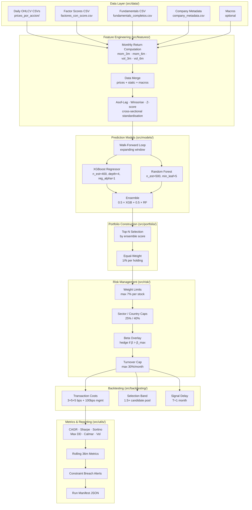

# Architecture Documentation

## System Overview

The pipeline is organised as a set of decoupled modules under `src/`, orchestrated by `pipeline.py`. Each module has a single responsibility and communicates through well-defined pandas DataFrames and dataclasses.

## Pipeline Architecture



## Module Responsibilities

| Module | Responsibility |
|--------|---------------|
| `src/data/loader.py` | Load and type-coerce price/factor/fundamental CSVs |
| `src/features/engineering.py` | Monthly resampling, feature computation, standardisation |
| `src/models/estimators.py` | XGBoost and Random Forest model factory |
| `src/models/walk_forward.py` | Expanding-window train/predict loop |
| `src/portfolio/construction.py` | Top-N selection, equal-weight allocation, benchmark |
| `src/backtesting/engine.py` | Realistic cost backtest with delay and selection band |
| `src/risk/limits.py` | Weight, sector, country, turnover constraints |
| `src/risk/beta.py` | Portfolio beta computation and hedge ratio |
| `src/utils/metrics.py` | Single canonical portfolio KPI implementation |
| `src/utils/monitor.py` | Rolling metrics, breach detection, text reporting |
| `src/utils/artifacts.py` | Artifact persistence, run manifest, directory management |
| `src/utils/config.py` | YAML loading, Paths/Config factory |
| `pipeline.py` | Top-level orchestration, 7-stage run, CLI entry |

## Configuration System

Two config profiles via YAML:

| Parameter | Production | Paper |
|-----------|------------|-------|
| beta_max | 1.1 | 1.2 |
| turnover_cap_m | 0.30 | 0.35 |
| mode | prod | paper |

All other parameters are shared. The pipeline accepts `--config` to switch profiles.

## Data Flow

```
CSV files  →  DataLoader  →  FeatureEngineer  →  WalkForward
                                                       ↓
                                              XGBoost + RF predictions
                                                       ↓
                                              Backtester (top-N selection)
                                                       ↓
                                        Risk constraints (limits, beta)
                                                       ↓
                                        backtest_with_real_costs()
                                                       ↓
                                         portfolio_kpis() + reports
```
